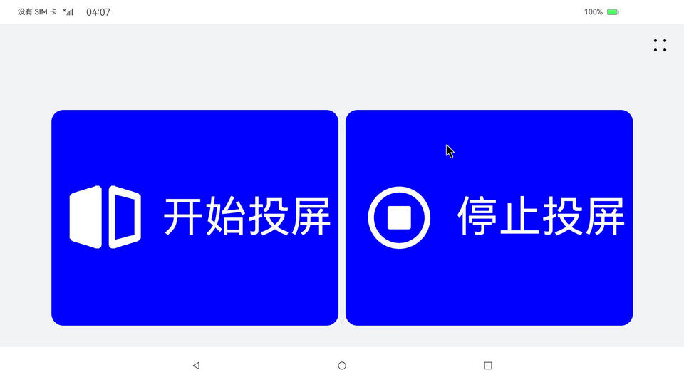
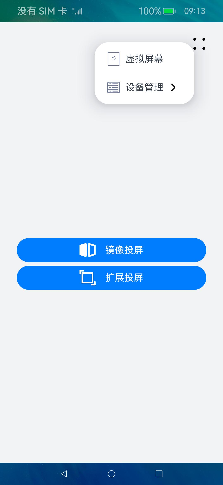
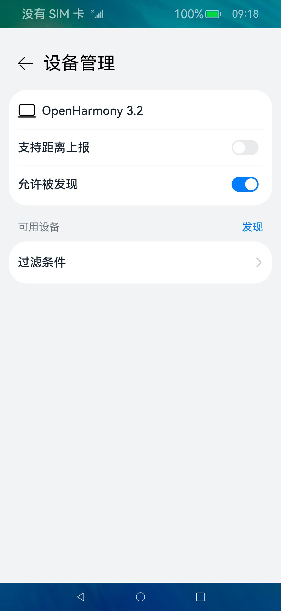
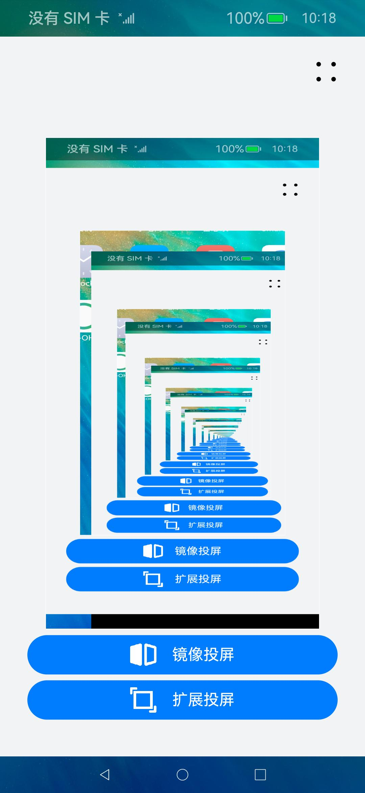

# 分布式屏幕示例

### 介绍

分布式屏幕功能早在OpenHarmony-3.1-Release就已经发布，详情可参考[官方仓库的介绍](https://gitee.com/openharmony/distributedhardware_distributed_screen)。

本示例基于OpenHarmony自带的分布式屏幕相关API，并简单实现了屏幕镜像（或扩展）投屏相关应用功能。示例主要分为ArkTS版本和C++版本，ArkTS版本目前主要基于API9版本分布式屏幕功能的API进行开发，API详细说明可参考：[@ohos.screen](https://docs.openharmony.cn/pages/v3.2/zh-cn/application-dev/reference/apis/js-apis-screen.md)。开发者可自行基于API10开发，其中API10版本增加了停止屏幕镜像(或扩展)的API。

### 效果预览

| 首页                                      | 菜单                                    | 设备管理                                                      | 虚拟屏幕                                                      |
| --------------------------------------- | ------------------------------------- | --------------------------------------------------------- | --------------------------------------------------------- |
|  |  |  |  |

使用说明

应用界面中展示可以点击镜像投屏或扩展投屏，为了添加分布式设备，可以在菜单中进入设备管理页面进行添加。此外，开发者可创建虚拟屏幕，在本机预览投屏后的效果（开启虚拟屏幕会增加系统负荷）。

### 工程目录

```
entry/src/main/
|-- ets
|   |-- common
|   |   |-- Constant.ets
|   |   |-- Logger.ts             // 日志工具
|   |   |-- TitleBar.ets
|   |-- entryability
|   |   |-- EntryAbility.ets
|   |-- model
|   |   |-- RemoteDeviceModel.ets
|   |-- pages
|   |   |-- DeviceManager.ets
|   |   |-- FilterOption.ets
|   |   |-- Index.ets            // 首页
|   |   |-- ListDeviceView.ets
|   |-- utils
|       |-- Permission.ts
...
docs
|-- distributed_screen
|   |-- BUILD.gn
|   |-- include
|   |-- src
|       |-- dscreen_expand.cpp  // 扩展投屏C++实现
|       |-- dscreen_mirror.cpp  // 镜像投屏C++实现
```

### 具体实现

#### ArkTS实现

通过在IDE中创建工程，并调用[@ohos.screen](https://docs.openharmony.cn/pages/v3.2/zh-cn/application-dev/reference/apis/js-apis-screen.md)中相关API进行实现，主要实现如下：

```
makeScreenMirror() {
    logger.info('makeScreenMirror')
    let mainScreenId = 0;
    let mirrorScreenIds: Array<number> = [];

    if (this.enableVirtualScreen) {
      mirrorScreenIds.push(this.virtualScreenId);
    }

    for (let i = this.allScreens.length - 1; i >= 0; i--) {
      if ((this.allScreens[i].id != 0) && (this.allScreens[i].id != 1)) {
        mirrorScreenIds.push(this.allScreens[i].id);
      }
    }

    if (mirrorScreenIds.length == 0) {
      constant.showToast("No found Screen!")
      return;
    }

    try {
      logger.info('mirrorScreenIds:' + JSON.stringify(mirrorScreenIds))
      screen.makeMirror(mainScreenId, mirrorScreenIds, (err, data) => {
        if (err.code) {
          constant.showToast("Failed to makeMirror")
          console.error('Failed to set screen mirroring. Code: ' + JSON.stringify(err));
          return;
        }
        constant.showToast("Succeeded to makeMirror")
        console.info('Succeeded in setting screen mirroring. Data: ' + JSON.stringify(data));
      });
    } catch (exception) {
      constant.showToast("Failed to makeMirror")
      console.error('Failed to set screen mirroring. Code: ' + JSON.stringify(exception));
    }
  }

  makeScreenExpand() {
    logger.info('makeScreenExpand')
    let mainScreenId = 0;
    let startX = display.getDefaultDisplaySync().width;
    let startY = 0;
    let expandExpandOption: Array<screen.ExpandOption> = [];

    expandExpandOption.push({ screenId: mainScreenId, startX: 0, startY: 0 });

    if (this.enableVirtualScreen) {
      expandExpandOption.push({ screenId: this.virtualScreenId, startX: startX, startY: startY });
    }

    for (let i = this.allScreens.length - 1; i >= 0; i--) {
      if ((this.allScreens[i].id != 0) && (this.allScreens[i].id != 1)) {
        expandExpandOption.push({ screenId: this.allScreens[i].id, startX: startX, startY: startY });
      }
    }

    if (expandExpandOption.length <= 1) {
      constant.showToast("No found Screen!")
      return;
    }

    try {
      screen.makeExpand(expandExpandOption)
        .then((data) => {
          constant.showToast("Succeeded to makeExpand")
          console.info('Succeeded in expanding the screen. Data: ' + JSON.stringify(data));
        })
        .catch((err) => {
          constant.showToast("Failed to makeExpand")
          console.error('Failed to expand the screen. Code:' + JSON.stringify(err));
        });
    } catch (exception) {
      constant.showToast("Failed to makeExpand")
      console.error('Failed to expand the screen. Code: ' + JSON.stringify(exception));
    }
  }


build() {
    Column() {
      Row() {
          Row() {
            Image($r('app.media.ic_more'))
              .padding(4)
              .width(40)
              .objectFit(ImageFit.Contain)
          }
          .alignItems(VerticalAlign.Center)
          .borderRadius(5)
          .width(60)
          .height(60)
          .backgroundColor($r('app.color.background_light_gray'))
          .bindMenu(this.IndexMenu)
      }
      .justifyContent(FlexAlign.End)
      .margin({ top: 6 })
      .width('100%')

      Scroll() {
        Column() {
          if (this.enableVirtualScreen) {
            XComponent({ id: 'xcomponent', type: 'surface', controller: this.xcomponentController })
              .onLoad(() => {
                this.xcomponentController.setXComponentSurfaceSize(
                  { surfaceWidth: this.virtualScreenWidth, surfaceHeight: this.virtualScreenHeight });
                this.createVirtualScreen(this.xcomponentController.getXComponentSurfaceId());
              })
              .width('75%')
              .height('75%')
              .backgroundColor(Color.White)
          }

          Button({ type: ButtonType.Capsule, stateEffect: true }) {
            Row() {
              Image($r('app.media.mirror'))
                .padding(4)
                .width(50)
                .objectFit(ImageFit.ScaleDown)
              Text($r('app.string.screen_mirror')).fontColor(0xffffff).margin({ left: 5, right: 12 })
            }.alignItems(VerticalAlign.Center)
          }
          .margin({ top: 6 })
          .width('85%')
          .height('6%')
          .onClick(() => {
            this.makeScreenMirror();
          })

          Button({ type: ButtonType.Capsule, stateEffect: true }) {
            Row() {
              Image($r('app.media.expand'))
                .padding(4)
                .width(50)
                .objectFit(ImageFit.ScaleDown)
              Text($r('app.string.screen_expand')).fontColor(0xffffff).margin({ left: 5, right: 12 })
            }.alignItems(VerticalAlign.Center)
          }
          .margin({ top: 6 })
          .width('85%')
          .height('6%')
          .onClick(() => {
            this.makeScreenExpand();
          })
        }
        .height('100%')
        .width('100%')
        .constraintSize({ minHeight: '100%' })
        .alignItems(HorizontalAlign.Center)
        .justifyContent(FlexAlign.Center)
      }
      .layoutWeight(1)
    }
    .height('100%')
    .backgroundColor($r('app.color.background_light_gray'))
  }
}
```


主要使用到[@ohos.screen](https://docs.openharmony.cn/pages/v3.2/zh-cn/application-dev/reference/apis/js-apis-screen.md)中的相关API如下：

| 方法名称                 | 描述                      |
| -------------------- | ----------------------- |
| screen.getAllScreens | 获取所有的屏幕，可以是本地屏幕和其他设备的屏幕 |
| screen.makeMirror    | 将屏幕设置为镜像模式              |
| screen.makeExpand    | 将屏幕设置为扩展模式              |


#### C/C++实现

基于分布式屏幕的C/C++相关API实现一个简单的程序，并增加BUILD.gn用于开发者自行编译验证参考。

> 说明：源码及BUILD.gn在OpenHarmony-3.2-Release版本有验证，OpenHarmony-4.x版本，需要修改BUILD.gn

完整源码和BUILD.gn内容如下。

1. dscreen_mirror.cpp

```c
#include <iostream>

#include "display.h"
#include "display_manager.h"
#include "dscreen_source_handler.h"
#include "dscreen_sink_handler.h"
#include "dscreen_util.h"
#include "idistributed_hardware_sink.h"
#include "idistributed_hardware_source.h"
#include "screen.h"
#include "screen_client.h"
#include "screen_client_common.h"
#include "screen_manager.h"
#include "wm_common.h"
#include "window.h"
#include "window_option.h"
#include "nativetoken_kit.h"
#include "token_setproc.h"

#include "softbus_adapter_mem.h"
#include "softbus_bus_center.h"
#include "softbus_common.h"

using namespace std;
using namespace OHOS;
using namespace OHOS::DistributedHardware;
using namespace OHOS::Rosen;
using namespace OHOS::Media;


int main(int argc, char **argv)
{
    uint64_t remoteScreenId;
    std::string remoteScreenName;
    std::vector<uint64_t> mirrorIds;

    // 获取 screen 列表
    std::vector<sptr<Screen>> allScreens = ScreenManager::GetInstance().GetAllScreens();

    // 选择待镜像的远程目标 screen
    // IsReal 返回true时 代表为本地screen / false为远程screen
    // GetName 当返回screen的id 包含远程设备信息
    // GetId 返回screenId
    for (auto screen: allScreens) {
        mirrorIds.push_back(screen->GetId());
    }

    for (auto screen: allScreens) {
        if (!screen->IsReal()) {
          // 仅找第一个远程screen
          remoteScreenId = screen->GetId();
          remoteScreenName = screen->GetName();
          break;
        }
    }

    printf("[DscreenMirror] remoteScreenId : %lu.\n", remoteScreenId);
    printf("[DscreenMirror] remoteScreenName : %s.\n", remoteScreenName.c_str());

    // 选择待镜像的本地screen
    sptr<OHOS::Rosen::Display> defaultDisplay = OHOS::Rosen::DisplayManager::GetInstance().GetDefaultDisplay();
    uint64_t localScreenId = defaultDisplay->GetScreenId();

    printf("[DscreenMirror] localScreenId : %lu...\n", localScreenId);

    // 调用接口并启动镜像投屏
    ScreenManager::GetInstance().MakeMirror(localScreenId, mirrorIds);

    printf("[DscreenMirror] Wait MakeMirror Stop.\n");
    getchar();

    // 停止
    std::vector<uint64_t> stopMirrorIds;
    stopMirrorIds.push_back(remoteScreenId);
    ScreenManager::GetInstance().RemoveVirtualScreenFromGroup(stopMirrorIds);

}
```

2. dscreen_expand.cpp

```c
#include <iostream>

#include "display.h"
#include "display_manager.h"
#include "dscreen_source_handler.h"
#include "dscreen_sink_handler.h"
#include "dscreen_util.h"
#include "idistributed_hardware_sink.h"
#include "idistributed_hardware_source.h"
#include "screen.h"
#include "screen_client.h"
#include "screen_client_common.h"
#include "screen_manager.h"
#include "wm_common.h"
#include "window.h"
#include "window_option.h"
#include "nativetoken_kit.h"
#include "token_setproc.h"

#include "softbus_adapter_mem.h"
#include "softbus_bus_center.h"
#include "softbus_common.h"

using namespace std;
using namespace OHOS;
using namespace OHOS::DistributedHardware;
using namespace OHOS::Rosen;
using namespace OHOS::Media;

int main(int argc, char **argv)
{
    uint64_t remoteScreenId;
    std::string remoteScreenName;

    // 获取 screen列表
    std::vector<sptr<Screen>> allScreens = ScreenManager::GetInstance().GetAllScreens();

    // 选择待镜像的远程目标 screen
    // IsReal 返回true时 代表为本地screen / false为远程screen
    // GetName 当返回screen的id 包含远程设备信息
    // GetId 返回screenId
    for (auto screen: allScreens) {
        if (!screen->IsReal()) {
          // 仅找第一个远程screen
          remoteScreenId = screen->GetId();
          remoteScreenName = screen->GetName();
          break;
        }
    }

    printf("[DscreenExpand] remoteScreenId : %lu.\n", remoteScreenId);
    printf("[DscreenExpand] remoteScreenName : %s.\n", remoteScreenName.c_str());

    // 选择待拓展的本地screen
    sptr<OHOS::Rosen::Display> defaultDisplay = OHOS::Rosen::DisplayManager::GetInstance().GetDefaultDisplay();
    uint64_t localScreenId = defaultDisplay->GetScreenId();

    printf("[DscreenExpand] localScreenId : %lu...\n", localScreenId);

    // 拓展屏幕与本地屏幕的位置关系
    std::vector<ExpandOption> options = {
        {localScreenId, 0, 0},
        {remoteScreenId, defaultDisplay->GetWidth(), 0}
    };

    // 调用结构启动拓展投屏
    ScreenManager::GetInstance().MakeExpand(options);

    printf("[DscreenExpand] Wait MakeExpand Stop.\n");
    getchar();

    // 停止投屏
    std::vector<uint64_t> stopExpandIds;
    stopExpandIds.push_back(remoteScreenId);
    ScreenManager::GetInstance().RemoveVirtualScreenFromGroup(stopExpandIds);

    return 0;
}
```

3. BUILD.gn（仅供参考）
   
   ```
   import("//build/ohos.gni")
   import("//build/ohos_var.gni")
   import("//foundation/distributedhardware/distributed_screen/distributedscreen.gni")
   
   ohos_executable("dscreen_mirror") {
     sources = ["src/dscreen_mirror.cpp"]
     include_dirs = [
       ".",
       "//foundation/distributedhardware/distributed_screen/interfaces/innerkits/native_cpp/screen_source/include",
       "//foundation/distributedhardware/distributed_screen/interfaces/innerkits/native_cpp/screen_source/include/callback",
       "//foundation/distributedhardware/distributed_hardware_fwk/common/utils/include",
       "//foundation/distributedhardware/distributed_screen/interfaces/innerkits/native_cpp/screen_sink/include",
       "//foundation/distributedhardware/distributed_screen/common/include/",
       "//foundation/distributedhardware/distributed_screen/services/screenclient/include/",
     ]
   
     cflags = [
       "-Wall",
       "-Werror",
       "-Wno-cast-qual",
       "-Wno-pointer-arith",
       "-Wno-unused-parameter",
       "-Wno-unused-variable",
       "-Wno-delete-incomplete",
     ]
   
     deps = [
       "${common_path}:distributed_screen_utils",
       "${interfaces_path}/innerkits/native_cpp/screen_sink:distributed_screen_sink_sdk",
       "${interfaces_path}/innerkits/native_cpp/screen_source:distributed_screen_source_sdk",
       "${services_path}/screenclient:distributed_screen_client",
       "${windowmanager_path}/dm:libdm",
       "${windowmanager_path}/wm:libwm",
       "//base/security/access_token/interfaces/innerkits/nativetoken:libnativetoken",
       "//base/security/access_token/interfaces/innerkits/token_setproc:libtoken_setproc",
       "//foundation/communication/dsoftbus/adapter:softbus_adapter",
       "//foundation/communication/dsoftbus/sdk:softbus_client",
       "//foundation/graphic/graphic_2d:libsurface",
       "//foundation/graphic/graphic_2d/rosen/modules/2d_graphics:2d_graphics",
       "//foundation/graphic/graphic_2d/rosen/modules/render_service_base/src/platform:platform",
       "//foundation/graphic/graphic_2d/rosen/modules/render_service_client:librender_service_client",
       "//foundation/systemabilitymgr/samgr/interfaces/innerkits/samgr_proxy:samgr_proxy",
     ]
   
     external_deps = [
       "hiviewdfx_hilog_native:libhilog",
       "multimedia_player_framework:media_client",
     ]
   
     install_enable = true
     install_images = [ "vendor" ]
     part_name = "rockchip_products"  # 根据实际编译的产品调整part_name 
   }
   
   ohos_executable("dscreen_expand") {
     sources = ["src/dscreen_expand.cpp"]
     include_dirs = [
       ".",
       "//foundation/distributedhardware/distributed_screen/interfaces/innerkits/native_cpp/screen_source/include",
       "//foundation/distributedhardware/distributed_screen/interfaces/innerkits/native_cpp/screen_source/include/callback",
       "//foundation/distributedhardware/distributed_hardware_fwk/common/utils/include",
       "//foundation/distributedhardware/distributed_screen/interfaces/innerkits/native_cpp/screen_sink/include",
       "//foundation/distributedhardware/distributed_screen/common/include/",
       "//foundation/distributedhardware/distributed_screen/services/screenclient/include/",
     ]
   
     cflags = [
       "-Wall",
       "-Werror",
       "-Wno-cast-qual",
       "-Wno-pointer-arith",
       "-Wno-unused-parameter",
       "-Wno-unused-variable",
       "-Wno-delete-incomplete",
     ]
   
     deps = [
       "${common_path}:distributed_screen_utils",
       "${interfaces_path}/innerkits/native_cpp/screen_sink:distributed_screen_sink_sdk",
       "${interfaces_path}/innerkits/native_cpp/screen_source:distributed_screen_source_sdk",
       "${services_path}/screenclient:distributed_screen_client",
       "${windowmanager_path}/dm:libdm",
       "${windowmanager_path}/wm:libwm",
       "//base/security/access_token/interfaces/innerkits/nativetoken:libnativetoken",
       "//base/security/access_token/interfaces/innerkits/token_setproc:libtoken_setproc",
       "//foundation/communication/dsoftbus/adapter:softbus_adapter",
       "//foundation/communication/dsoftbus/sdk:softbus_client",
       "//foundation/graphic/graphic_2d:libsurface",
       "//foundation/graphic/graphic_2d/rosen/modules/2d_graphics:2d_graphics",
       "//foundation/graphic/graphic_2d/rosen/modules/render_service_base/src/platform:platform",
       "//foundation/graphic/graphic_2d/rosen/modules/render_service_client:librender_service_client",
       "//foundation/systemabilitymgr/samgr/interfaces/innerkits/samgr_proxy:samgr_proxy",
     ]
   
     external_deps = [
       "hiviewdfx_hilog_native:libhilog",
       "multimedia_player_framework:media_client",
     ]
   
     install_enable = true
     install_images = [ "vendor" ]
     part_name = "rockchip_products" # 根据实际编译的产品调整part_name 
   }
   
   group("distributed_screen") {
     deps = [
       ":dscreen_mirror",
       ":dscreen_expand",
     ]
   }
   ```
   
   

### 相关权限

默认添加以下权限

| 权限名称                                 | 描述                         |
| ------------------------------------ | -------------------------- |
| ohos.permission.CAPTURE_SCREEN       | 允许应用截取屏幕图像                 |
| ohos.permission.DISTRIBUTED_DATASYNC | 允许不同设备间的数据交换               |
| ohos.permission.GET_BUNDLE_INFO      | 允许应用查询其他应用的信息。该权限仅适用于三方应用。 |
| ohos.permission.INTERNET             | 允许使用Internet网络             |

> 说明：应用需采用系统签名，部分权限可根据是否使用相关模块进行删除

### 依赖

不涉及。

### 约束与限制

1. 本示例仅支持标准系统上运行。

2. 本示例已验证API version 11版本SDK，版本号：4.1.7.8。

3. 本示例需要使用DevEco Studio 5.0.2 Release及以上版本才可编译运行。

### 下载

如需单独下载本工程，执行如下命令：

```
git clone git@gitee.com:algoideas/DistributedScreen.git
```
